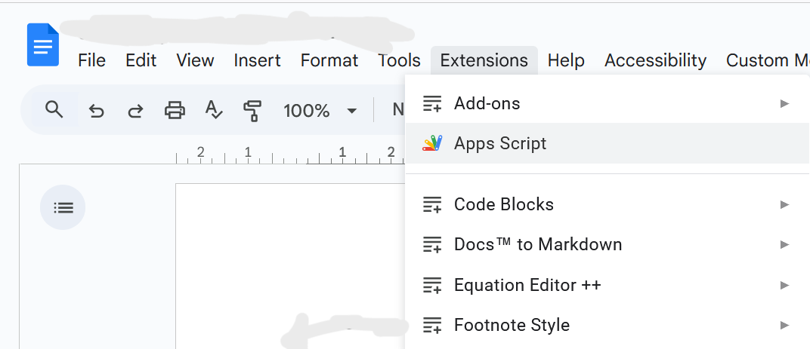
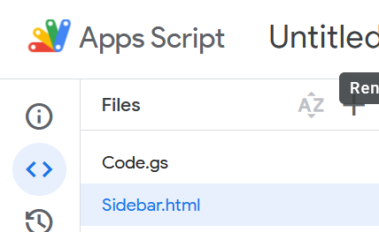
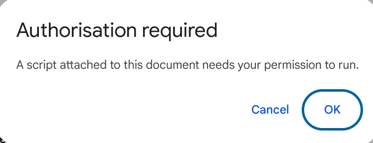
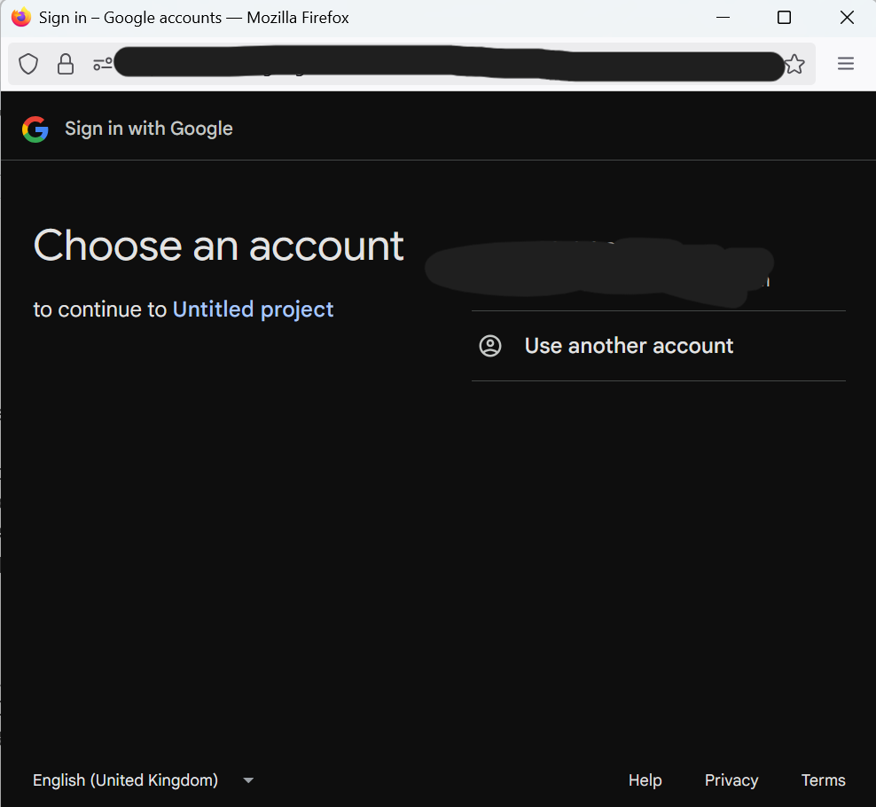
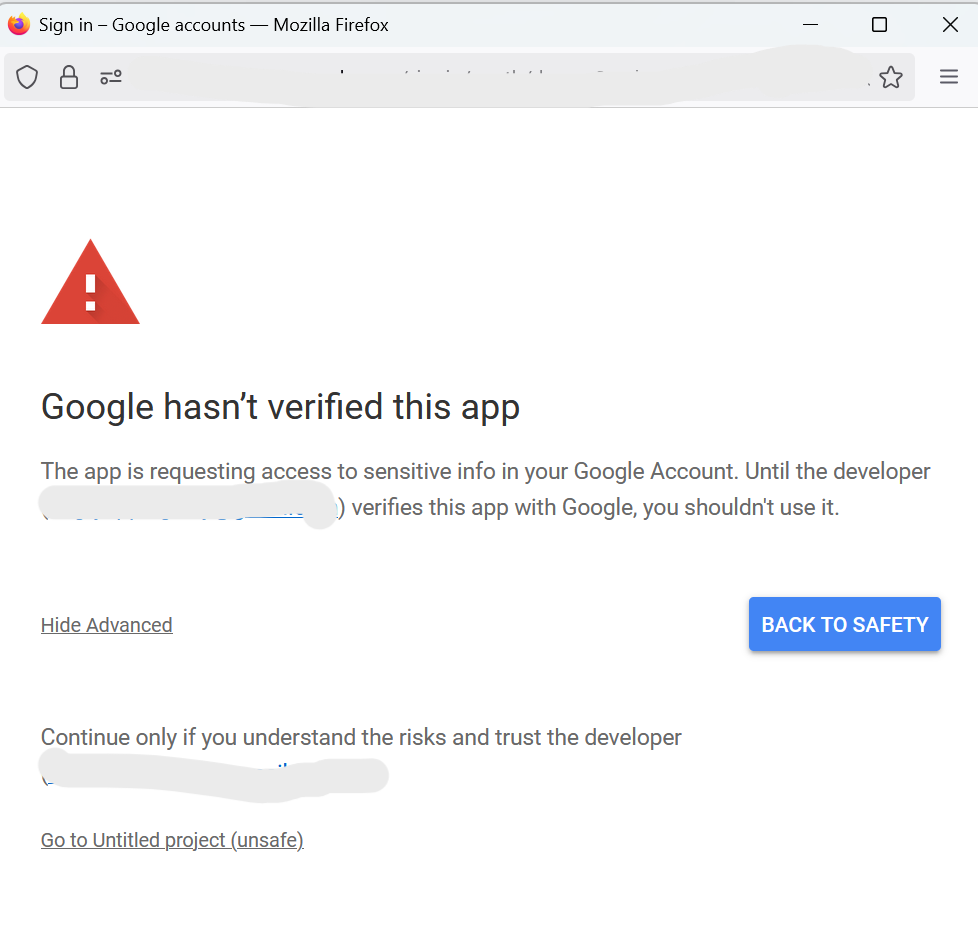
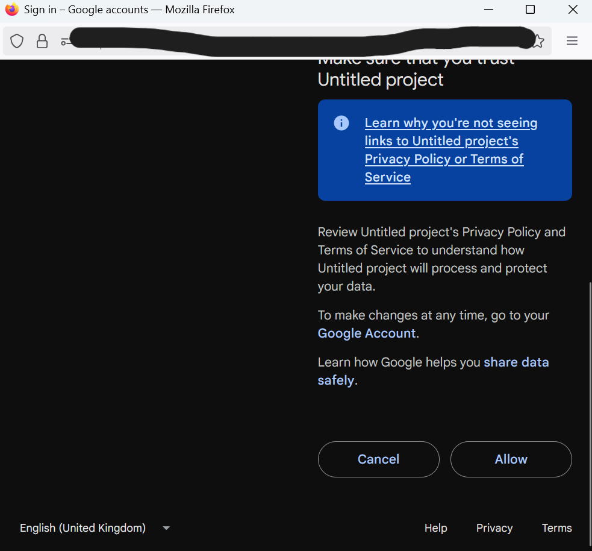
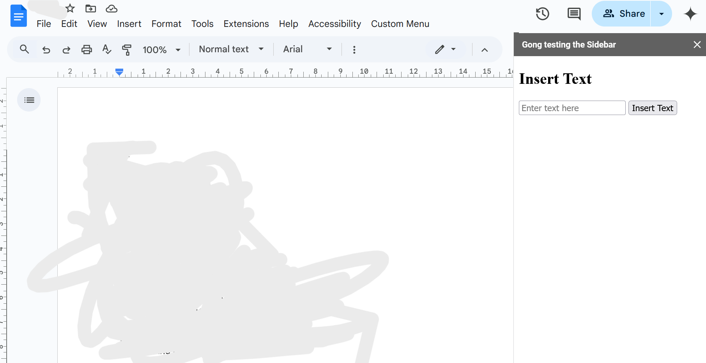

# Google Docs Extension

Latches onto Google's [apps script](https://developers.google.com/apps-script).

## Setup instructions

This builds the sample project *locally*.

1. Open a google document
2. Click `Extensions > Apps Script`

3. Replace the code in `Code.gs` with the code here
4. Add a file called `Sidebar.html` and add the code from here 

5. `Ctrl + S` to save the project
6. Reload the google document and give the relevant permissions

7. If everything works, you should see the below image

